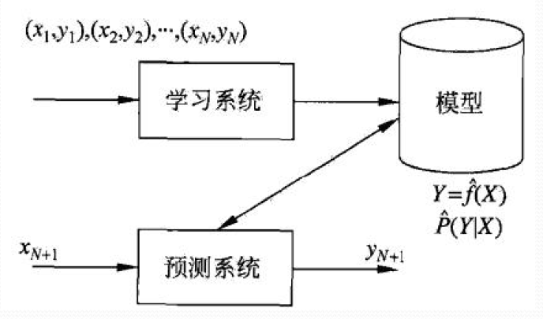
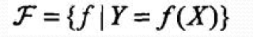
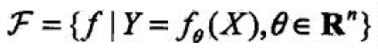
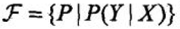
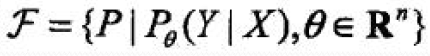
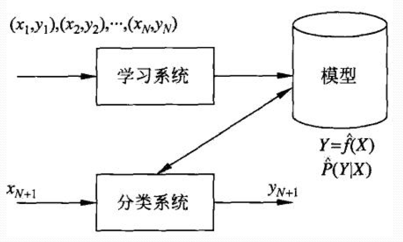

# 
第一章  统计学习方法概论

## 1.1 统计学习
### 1. 统计学习的特点
    统计学习是关于计算机基于数据构建概率统计模型并运用对数据进行预测和分析的一门学科，统计学习也称为机器学习.
### 2. 统计学习的对象
    数据：存在于计算机及网络上的各种数字、文字、图像、视频、音频以及他们的组合
    前提：同类数据具有一定的统计规律性
### 3. 统计学习的目的
    目的：对未知新数据进行预测和分析
    实现：通过构建概率统计模型实现对数据的预测和分析
### 4. 统计学习的方法
    一：分类（本书主要讨论监督学习）
     1. 监督学习
     2. 非监督学习
     3. 半监督学习
     4. 强化学习
    二：三要素
     * 模型：模型的建设空间
     * 策略：模型的选择的准则
     * 算法：模型学习的算法
    三：步骤
     1. 得到一个有限的训练数据集合
     2. 确定学习模型
     3. 确定学习策略
     4. 确定学习算法
     5. 选择最优模型
     6. 利用最优模型对新数据进行预测或分析
### 5. 统计学习的研究
    统计学习方法、统计学习理论、统计学习应用
### 6. 统计学习的重要性
    必不可少

## 1.2 监督学习

### 1.2.1 基本概念
    1. 输入空间、特征空间与输出空间
    将输入与输出所有可能取值的集合分别称为输入空间与输出空间，通常输出空间远远大于输入空间
    特征空间：所有特征向量存在的空间称为特征空间，特征空间每一维对应一个特征
    输入数据与输出数据成对组成 
    2. 联合概论分布
    监督学习假设输入与输出的随机变量X和Y遵循联合概率分布P(X,Y),对于学习系统来说，联合概率分布是未知的，训练数据和测试数据被看作是依联合概率分布P(X,Y)独立同分布产生的。
    3. 假设空间
    监督学习目的是学习一个由输入到输出的映射，称为模型,映射的集合是假设空间。
    监督学习的模型可以分为概率模型和非概率模型，使用条件概率P(X|Y)和决策函数Y=f(X)表示
### 1.2.2 问题的形式化

## 1.3 统计学习三要素

方法 = 模型 + 策略 + 算法

### 1.3.1 模型
    在监督学习中，模型就是所要学习的条件概率分布或决策函数。模型的假设空间包含所有可能的条件概率分布和决策函数

 1. 决策函数的假设空间：
 参数空间：
 2. 条件概率的假设空间： 参数空间: 

### 1.3.2 策略
损失函数度量模型一次预测的好坏，风险函数度量平均意义下模型预测的好坏。
 
1. 损失函数和风险函数
用损失函数（loss function）或 代价函数（cost function）来度量预测错误的程度，记作$L(Y,f(X))$。

常用到的损失函数有一下几种：（page 7）
    * 0-1损失函数
    * 平方损失函数
    * 绝对值损失函数
    * 对数损失函数

    损失函数值越小，模型越好。

2. 经验风险最小化和结构风险最小化

    （1）经验风险最小化的策略认为经验风险最小的模型是最优的模型，根据这一策略，按照经验最小化求最优模型就是求解最优化问题：$min \frac{1}{N} \sum ^N _{i=1} L(y_{i},f(x_i))$ 。

    （2）结构风险最小化是为了防止过拟合而提出的策略。等价于正则化。结构风险在经验风险上加上对复杂模型的惩罚。$\lambda$ $>=0$ 是系数，用以权衡经验风险和模型复杂度。定义是$\frac{1}{N} \sum ^N _{i=1} L(y_{i},f(x_i))+\lambda J(f)$。

    （3）当模型是条件概率分布，损失函数是对数函数时，经验风险最小化就等价于极大似然估计。在样本容量较小的情况下容易过拟合。

### 1.3.3 算法（page 9）

## 1.4 模型评估与模型选择
### 1.4.1 训练误差与测试误差
    当两种损失一致时比较理想
### 1.4.2 过拟合与模型选择
    过拟合时指学习时选择的模型包含的参数过多，以致于出现这一模型对已知数据预测的很好，但对未知数据测试表现很差的现象。
书上例题：P11

## 1.5 正则化与交叉验证（两种模型选择方法）
### 1.5.1 正则化
    正则化的作用是选择经验风险与模型复杂度同时较小的模型。
  正则化具有如下形式:

 $min \frac{1}{N} \sum ^N _{i=1} L(y_{i},f(x_i)) + \lambda J(f)$
 
 其中，第一项时经验风险，第二项是正则化项。$\lambda$>=0.正则化项一般是模型复杂度的单调递增函数，模型越复杂，$\lambda$ 越大。
正则项一般有两种形式：

(1) $L_{2}$ 范式 $||w||^2$ 

(2)  $L_{1}$ 范式 $||w||$

### 1.5.2 交叉验证
一：数据集的分割
* 训练集：用来训练模型
* 验证集：用于模型的选择
* 测试集：用于对学习方法的评估

二：交叉验证方法
1. 简单交叉验证：数据7-3分，选出测试误差最小的模型
2. S折交叉验证：数据分为S子集，利用S-1个子集的数据训练模型，余下的子集测试模型。最后选出S次评测中平均误差最小的模型
3. 留一交叉验证：S折交叉验证的特殊情况S=N，在缺乏数据时使用。

## 1.6 泛化能力
### 1.6.1 泛化误差
    泛化误差就是所学习到的模型的期望风险
### 1.6.2 泛化误差上界
    学习方法的泛化能力分析往往是通过研究泛化误差的概率上界进行的。集由一下两点性质：
    1. 它是样本容量的函数，当样本容量增大时，泛化上界趋于0
    2. 假设空间容量越大，模型就越难学，泛化误差上界就越大

## 1.7 生成模型与判别模型
                 监督学习还可以分为生成方法和判别方法

1. 生成方法
   * 生成方法由数据学习联合概率分布$P(X,Y)$，然后求出条件概率分布$P(Y|X)$ 作为预测的模型，即生成模型:$P(Y|X) = \frac{P(X,Y)}{P(X)}$。
   * 模型表示了给定输入X产生输出Y的生成关系
   * 典型的模型: 朴素贝叶斯模型、隐马尔可夫模型
2. 判别方法
   * 判别方法由数据直接学习决策函数$f(x)$或者条件概率分布$P(Y|X)$作为预测的模型。
   * 判别方法关心的是给定的输入X，应该怎样的预测出Y。
   * 典型的模型: k近邻法、感知器、决策树、逻辑斯蒂回归等等。
3. 特点
   生成方法能还原出联合概率分布，而判别方法不能。生成方法的收敛速度更快，判别方法的准确率更高。当存在隐变量时，判别方法就不可以使用了。判别方法可以简化学习问题。

## 1.8 分类问题(本书主讲二分类)

### 评价标准
    通常以关注的类为正类，其他类为负类。
|mark |意义|
| ------| ------|
|TP |  将正类预测为正类|
|FN | 将正类预测为负类|
|FP | 将负类预测为正类|
|TN | 将负类预测为负类|

* 精确率：$P=\frac{TP}{TP+FP}$
* 召回率：$R = \frac{TP}{TP+FN}$
* $F_1$值：是精确率和召回率的调和均值 $\frac{2}{F_1}={\frac{1}{P} + \frac{1}{R}}$

## 1.9 标注问题（P20）
    标注问题的输入是一个观测序列，输出是一个标记序列或状态序列
## 1.10 回归问题
    1. 回归模型表示从输入变量到输出变量之间映射的函数。等价于函数拟合：选择一条函数曲线使其很好地拟合已知数据且很好地预测未知数据。
    2. 回归学习最常用的损失函数是平法损失函数，在此情况下回归问题可以用最小二乘法求解。
